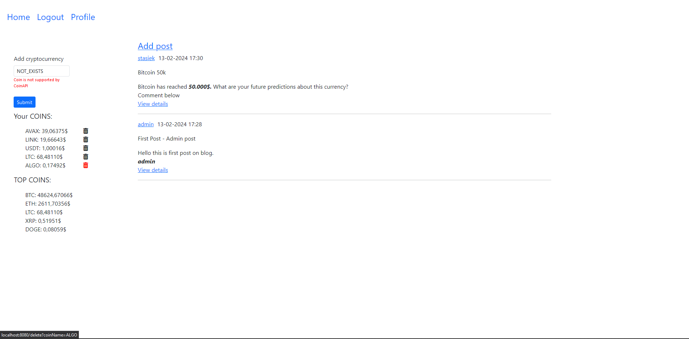
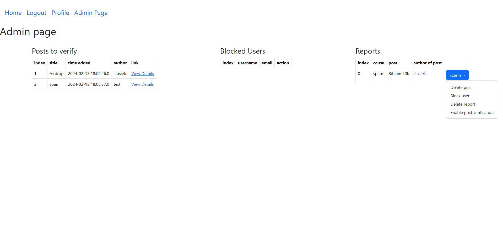

# Web blog application written using Spring, Hibernate, MySQL and Thymeleaf.


## Running the application locally


1. Get your free API key on [COIN API]("https://rest.coinapi.io/v1/exchangerate/") and paste it inside
    `src/main/java/com/example/blogjava/crypto/CoinApiService.java`
2. Inside `application.yml` specify database and mail credentials
3. Run your application. There are several ways to run a Spring Boot application on your local machine. One way is to execute the `main` method in the `src/main/java/com/example/blogjava/BlogJavaApplication.java` class from your IDE.

Alternatively you can use the [Spring Boot Maven plugin](https://docs.spring.io/spring-boot/docs/current/reference/html/build-tool-plugins-maven-plugin.html) like so:
```shell
mvn spring-boot:run
```

## Functionalities

|                                                        | anonymous user | user | blocked user | admin |
|--------------------------------------------------------|----------------|------|--------------|-------|
| read posts                                             | +              | +    | +            | +     |
| view profiles                                          | +              | +    | +            | +     |
| add coins                                              | -              | +    | -            | +     |
| view base coin prices                                  | +              | +    | +            | +     |
| create, report, comment posts                          | -              | +    | -            | +     |
| delete, verify post                                    | -              | -    | -            | +     |
| delete, block, unblock users, enable post verification | -              | -    | -            | +     |


## Usage

### Home page
The home page features a central section displaying the latest added posts, providing users with up-to-date information. 
Additionally, on the side panel, there is valuable data about various cryptocurrencies. The "Your COINS" section allows users to track specific coins they've added, with a user-friendly form that includes validations. 
Users have the option to add any currency supported by an external API. 



### Admin page

This is how admin page looks like. User with ADMIN_ROLE can manage post content.
Admin can:
- delete
- block / unblock user
- or enable post verification for specific user.



### Registration

Registration from contains full validation. After successful registration, the system sends a welcome e-mail


## Next steps of development
1. Divide into backend and frontend
   - Implement RESTful API
   - Develop a responsive frontend using Angular
2. Testing
